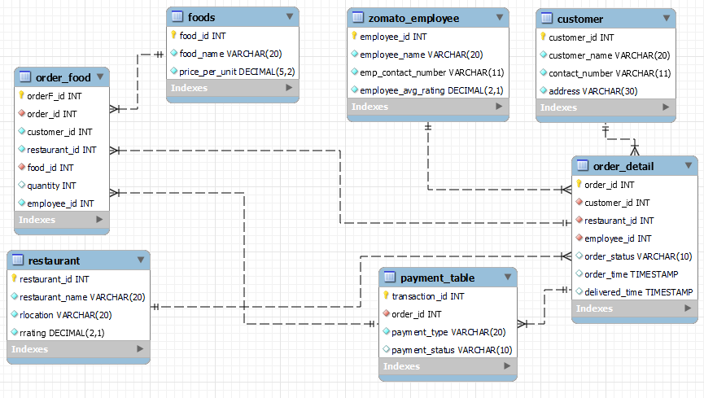

# 🍽️ Zomato SQL Business Analysis

<p align="center">


</p>

---

# 🚀 Project Overview

The **Zomato SQL Business Analysis** project focuses on extracting meaningful business insights from a food delivery database using **MySQL**.

The project demonstrates real-world SQL techniques including **Joins, Aggregate Functions, Common Table Expressions (CTEs), Window Functions, Date & Time Functions, Ranking Functions, and Business KPI Analysis** to solve practical business problems faced by food delivery platforms.

---

# Entity Relationship (ER) Diagram



---

# 🎯 Business Objective

The objective of this project is to help business stakeholders:

✅ Identify top-performing customers

✅ Analyze restaurant performance

✅ Evaluate delivery efficiency

✅ Monitor revenue generation

✅ Understand customer ordering behavior

✅ Support data-driven business decisions

---

# 📊 Business Problems Solved

The project answers the following business questions:

### 👤 Customer Analytics

- Top 3 customers with the highest number of orders
- Average order amount per customer
- Most frequent customer for each restaurant

---

### 🍽️ Restaurant Analytics

- Restaurant with the highest average rating
- Second highest revenue-generating restaurant
- Restaurant with the most diverse menu

---

### 🍕 Food Analytics

- Revenue generated by each food item
- Top 5 most popular food items
- Top 5 most expensive food items

---

### 🚚 Delivery Analytics

- Orders delivered in under 30 minutes
- Average delivery time on weekdays vs weekends

---

### 📅 Order Analytics

- Month with the highest number of orders
- Weekend order analysis

---

### 💳 Payment Analytics

- Total payment amount by payment type

---

# 🛠 SQL Concepts Used

✔ SELECT Statements

✔ WHERE Clause

✔ GROUP BY

✔ HAVING

✔ ORDER BY

✔ LIMIT

✔ Aggregate Functions

✔ INNER JOIN

✔ Multiple Table Joins

✔ Common Table Expressions (CTEs)

✔ Window Functions

✔ ROW_NUMBER()

✔ DENSE_RANK()

✔ Date Functions

✔ Time Functions

✔ CASE Statements

✔ TIMESTAMPDIFF()

✔ MONTHNAME()

✔ DAYNAME()

---

# ⚙️ Technologies Used

| Tool | Purpose |
|------|----------|
| 🛢 MySQL | Database Management |
| 💻 MySQL Workbench | Query Development |
| 📝 SQL | Data Analysis |
| 📊 Relational Database | Business Analytics |

---

# 🔄 Project Workflow

```text
Raw Zomato Database
        │
        ▼
Database Exploration
        │
        ▼
Data Extraction
        │
        ▼
SQL Query Development
        │
        ▼
Business Analysis
        │
        ▼
Actionable Insights
```

---

# 📂 Project Structure

```
Zomato-SQL-Business-Analysis
│
├── Dataset
├── Database Schema
├── SQL Queries
├── Business Problems
└── README.md
```

---

# 📁 Folder Structure

```text
Zomato-SQL-Business-Analysis/
│
├── README.md
├── Zomato_DB_Analysis.sql
├── Database/
│   └── Zomato_Database.sql
├── images/
│   └── ER Diagram.png
└── .gitignore
```

---

# 💡 Key Business Insights

📌 Identified the platform's highest-value customers based on order frequency.

📌 Ranked restaurants according to ratings and revenue performance.

📌 Calculated revenue generated by individual food items.

📌 Identified the most popular food items using sales quantity.

📌 Measured delivery performance using average delivery time.

📌 Compared delivery efficiency between weekdays and weekends.

📌 Determined monthly ordering trends to identify peak business periods.

📌 Analyzed payment methods to understand customer payment preferences.

📌 Used ranking functions and CTEs to solve complex analytical problems.

---

# 🛠 Skills Demonstrated

✅ SQL Query Writing

✅ Database Analysis

✅ Relational Database Concepts

✅ Data Cleaning

✅ Data Exploration

✅ Aggregate Functions

✅ Joins

✅ Common Table Expressions (CTEs)

✅ Window Functions

✅ Ranking Functions

✅ Date & Time Functions

✅ Business Analytics

✅ KPI Analysis

---

# 🌟 Business Value

This project helps businesses to:

📊 Improve customer understanding

🍽️ Evaluate restaurant performance

🚚 Optimize delivery operations

💰 Track revenue generation

📈 Monitor ordering trends

🎯 Support strategic decision-making using SQL analytics

---

# 🔮 Future Enhancements

- 📊 Interactive Power BI Dashboard
- 🐍 Python Exploratory Data Analysis (EDA)
- 🤖 Customer Segmentation using Machine Learning
- 📈 Sales Forecasting
- 🚚 Delivery Time Prediction
- 📍 Restaurant Performance Dashboard

---

# 📚 Learning Outcomes

Through this project, I strengthened my skills in:

- ✔ Advanced SQL
- ✔ Joins
- ✔ Aggregate Functions
- ✔ Window Functions
- ✔ Common Table Expressions (CTEs)
- ✔ Business Problem Solving
- ✔ Data Analysis
- ✔ Relational Database Management

---


---
